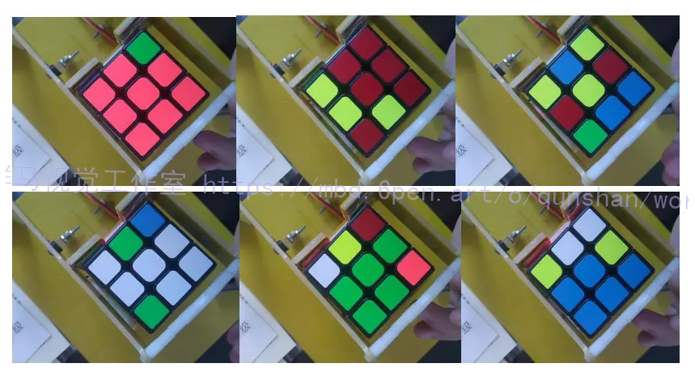
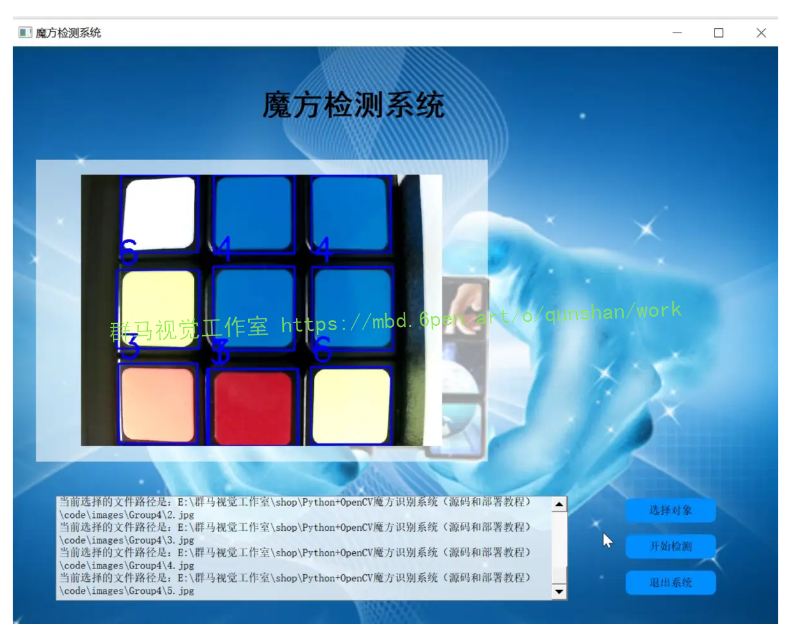
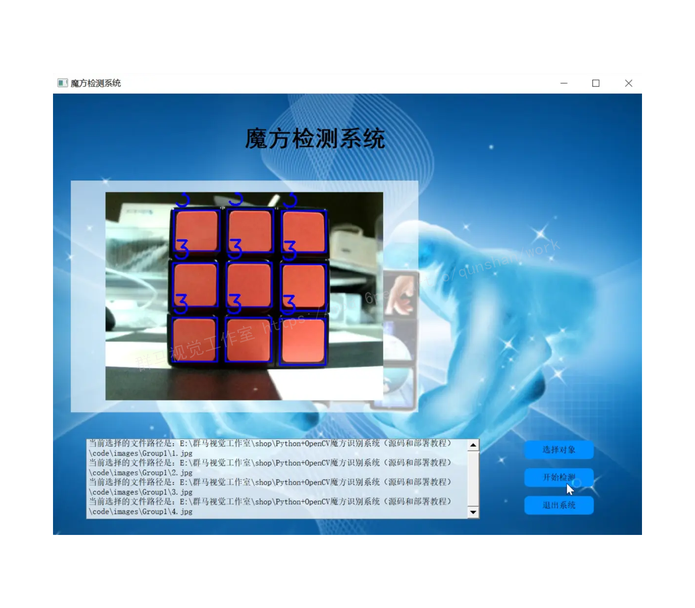
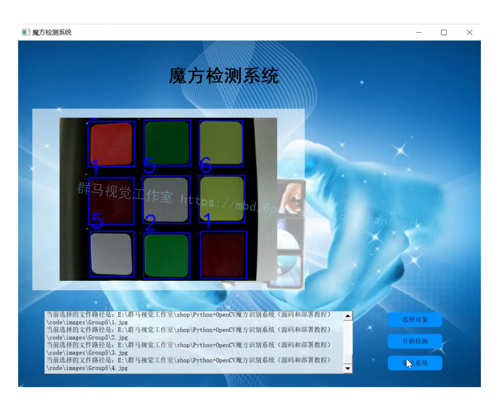
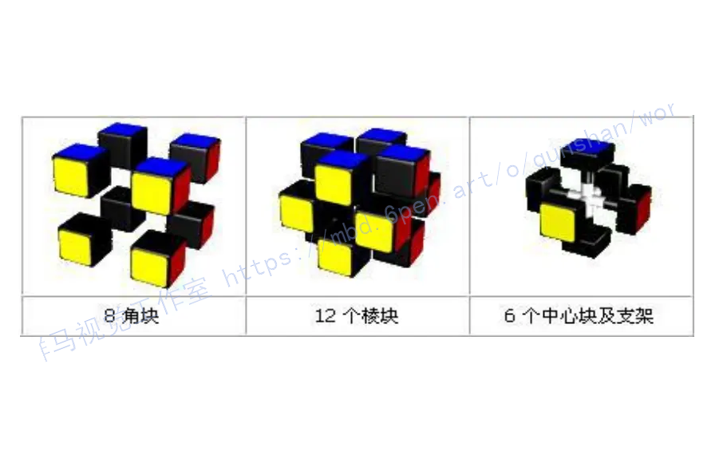
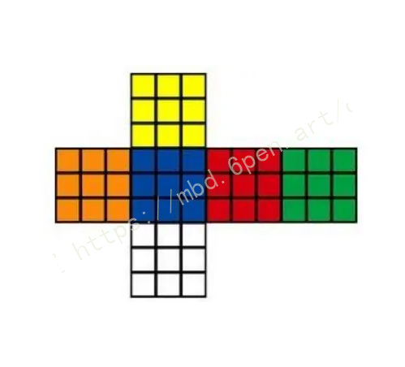
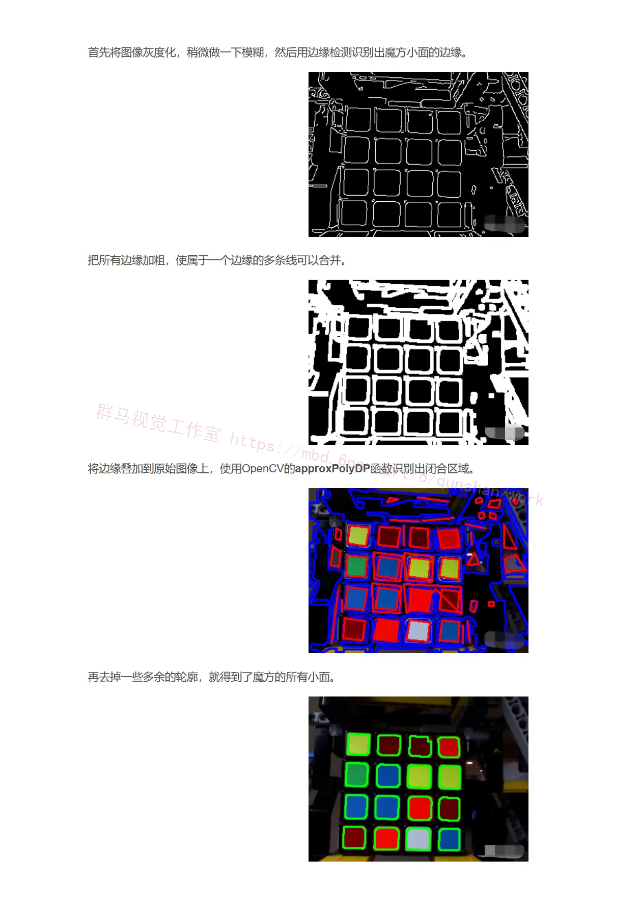
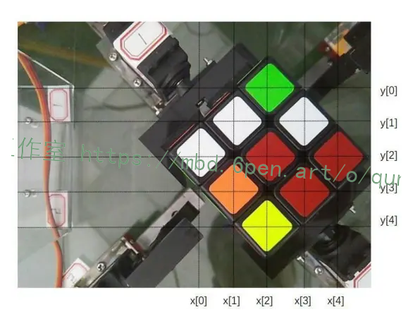
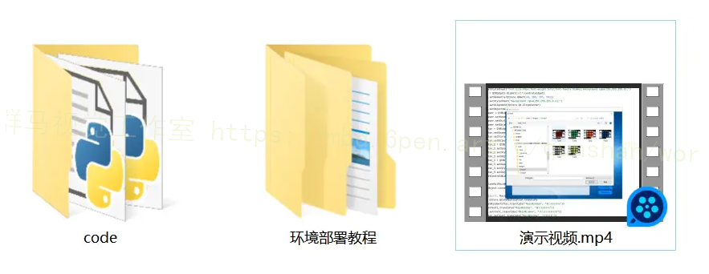



## 1.研究背景

近年来，随着计算机视觉技术的快速发展，人们对于图像处理和模式识别的需求也越来越大。其中，魔方识别系统是一个备受关注的研究领域。魔方作为一种具有复杂结构和多变性的立体拼图，其解决方案一直是计算机视觉领域的一项挑战。而Python和OpenCV作为目前最流行的图像处理工具，被广泛应用于魔方识别系统的开发中。

传统的魔方识别方法主要依赖于人工操作和视觉判断，这种方法存在识别速度慢、准确率低等问题。而基于计算机视觉的魔方识别系统可以通过图像处理和模式识别技术，实现对魔方的自动识别和还原。这不仅可以提高魔方的解决效率，还可以为魔方爱好者提供一个更加便捷和准确的解决方案。

Python作为一种简洁、易学、功能强大的编程语言，具有丰富的图像处理库和机器学习工具，适合用于魔方识别系统的开发。而OpenCV作为一个开源的计算机视觉库，提供了丰富的图像处理和模式识别算法，可以方便地实现对魔方图像的处理和分析。


## 2.研究内容和意义

本研究的目的是基于Python和OpenCV开发一个魔方识别系统，并提供相应的源码和部署教程。通过该系统，用户可以将魔方的图像输入，系统可以自动识别魔方的状态，并给出相应的还原方案。具体来说，本研究的主要内容包括以下几个方面：

1. 图像预处理：通过使用OpenCV提供的图像处理算法，对输入的魔方图像进行预处理，包括图像去噪、边缘检测、图像分割等操作，以提高后续的识别准确率。

2. 特征提取与模式识别：通过使用OpenCV提供的特征提取算法，对预处理后的图像进行特征提取，以获取魔方的状态信息。然后，通过机器学习算法，对提取到的特征进行模式识别，以确定魔方的状态。

3. 还原方案生成：根据识别到的魔方状态，使用经典的还原算法，生成相应的还原方案。通过该方案，用户可以轻松地还原魔方，提高解决效率。

本研究的意义主要体现在以下几个方面：

1. 提高魔方解决效率：传统的魔方解决方法主要依赖于人工操作和视觉判断，效率较低。而基于计算机视觉的魔方识别系统可以实现对魔方的自动识别和还原，大大提高了解决效率。

2. 推动计算机视觉技术的发展：本研究基于Python和OpenCV开发魔方识别系统，将为计算机视觉技术的研究和应用提供一个实际的案例。同时，通过提供源码和部署教程，可以帮助更多的开发者学习和应用计算机视觉技术。

3. 拓展魔方应用领域：魔方作为一种立体拼图，具有广泛的应用领域，如机器人导航、虚拟现实等。通过开发魔方识别系统，可以为这些应用领域提供一个更加便捷和准确的解决方案。

总之，基于Python和OpenCV开发的魔方识别系统具有重要的研究意义和应用价值。通过该系统，可以提高魔方的解决效率，推动计算机视觉技术的发展，并拓展魔方的应用领域。同时，通过提供源码和部署教程，可以帮助更多的开发者学习和应用计算机视觉技术。

# 3.图片演示






# 4.视频演示
[Python+OpenCV魔方识别系统（源码和部署教程）_哔哩哔哩_bilibili](https://www.bilibili.com/video/BV1Qu4y1Q7mP/?vd_source=ff015de2d29cbe2a9cdbfa7064407a08)


# 5.核心代码讲解

#### 5.1 colordetection.py

```python

class ColorDetection:

    def __init__(self):
        self.prominent_color_palette = {
            'red'   : (0, 0, 255),
            'orange': (0, 165, 255),
            'blue'  : (255, 0, 0),
            'green' : (0, 255, 0),
            'white' : (255, 255, 255),
            'yellow': (0, 255, 255)
        }

        # Load colors from config and convert the list -> tuple.
        self.cube_color_palette = config.get_setting(
            CUBE_PALETTE,
            self.prominent_color_palette
        )
        for side, bgr in self.cube_color_palette.items():
            self.cube_color_palette[side] = tuple(bgr)

    def get_prominent_color(self, bgr):
        """Get the prominent color equivalent of the given bgr color."""
        for color_name, color_bgr in self.cube_color_palette.items():
            if tuple([int(c) for c in bgr]) == color_bgr:
                return self.prominent_color_palette[color_name]
        return COLOR_PLACEHOLDER

    def get_dominant_color(self, roi):
        """
        Get dominant color from a certain region of interest.

        :param roi: The image list.
        :returns: tuple
        """
        pixels = np.float32(roi.reshape(-1, 3))

        n_colors = 1
        criteria = (cv2.TERM_CRITERIA_EPS + cv2.TERM_CRITERIA_MAX_ITER, 200, .1)
        flags = cv2.KMEANS_RANDOM_CENTERS
        _, labels, palette = cv2.kmeans(pixels, n_colors, None, criteria, 10, flags)
        _, counts = np.unique(labels, return_counts=True)
        dominant = palette[np.argmax(counts)]
        return tuple(dominant)

    def get_closest_color(self, bgr):
        """
        Get the closest color of a BGR color using CIEDE2000 distance.

        :param bgr tuple: The BGR color to use.
        :returns: dict
        """
        lab = bgr2lab(bgr)
        distances = []
        for color_name, color_bgr in self.cube_color_palette.items():
            distances.append({
                'color_name': color_name,
                'color_bgr': color_bgr,
                'distance': ciede2000(lab, bgr2lab(color_bgr))
            })
        closest = min(distances, key=lambda item: item['distance'])
        return closest

    def convert_bgr_to_notation(self, bgr):
        """
        Convert BGR tuple to rubik's cube notation.
        The BGR color must be normalized first by the get_closest_color method.

        :param bgr tuple: The BGR values to convert.
        :returns: str
        """
        notations = {
            'green' : 'F',
            'white' : 'U',
            'blue'  : 'B',
            'red'   : 'R',
            'orange': 'L',
            'yellow': 'D'
        }
        color_name = self.get_closest_color(bgr)['color_name']
        return notations[color_name]

    def set_cube_color_pallete(self, palette):
        """
        Set a new cube color palette. The palette is being used when the user is
        scanning his cube in solve mode by matching the scanned colors against
        this palette.
        """
        for side, bgr in palette.items():
            self.cube_color_palette[side] = tuple([int(c) for c in bgr])

color_detector = ColorDetection()
```
这段代码定义了一个名为`ColorDetection`的类，用于颜色检测。其中包含了以下方法：

- `__init__(self)`: 初始化方法，设置了默认的颜色列表。
- `get_prominent_color(self, bgr)`: 根据给定的BGR颜色获取对应的主要颜色。
- `get_dominant_color(self, roi)`: 从给定的感兴趣区域获取主要颜色。
- `get_closest_color(self, bgr)`: 根据给定的BGR颜色，使用CIEDE2000距离获取最接近的颜色。
- `convert_bgr_to_notation(self, bgr)`: 将BGR颜色转换为魔方符号表示。
- `set_cube_color_pallete(self, palette)`: 设置新的魔方颜色列表。

最后，创建了一个`ColorDetection`的实例`color_detector`。

该程序文件名为colordetection.py，是一个颜色检测的类。该类包含以下方法：

1. `__init__(self)`：初始化方法，定义了颜色的调色板，包括突出颜色调色板和魔方颜色调色板。

2. `get_prominent_color(self, bgr)`：根据给定的BGR颜色获取对应的突出颜色。

3. `get_dominant_color(self, roi)`：从给定的感兴趣区域获取主要颜色。

4. `get_closest_color(self, bgr)`：使用CIEDE2000距离获取给定BGR颜色的最接近颜色。

5. `convert_bgr_to_notation(self, bgr)`：将BGR颜色转换为魔方符号表示。

6. `set_cube_color_pallete(self, palette)`：设置新的魔方颜色调色板。

7. `color_detector = ColorDetection()`：创建一个ColorDetection对象。

该程序还导入了以下模块和文件：

1. `numpy`：用于处理数组和矩阵的库。

2. `cv2`：OpenCV库，用于图像处理和计算机视觉。

3. `helpers`：自定义的辅助函数模块。

4. `config`：自定义的配置模块。

5. `constants`：自定义的常量模块。

需要注意的是，该程序文件中的代码是一个类的定义，没有实际执行的部分。要使用该类，需要在其他地方创建一个ColorDetection对象，并调用其方法。

#### 5.2 config.py

```python

class Config:

    def __init__(self):
        self.config_dir = os.path.expanduser('~/.config/qbr')
        self.settings_file = os.path.join(self.config_dir, 'settings.json')

        try:
            self.settings = json.loads(open(self.settings_file, 'r').read())
        except Exception:
            self.settings = {}

        if not os.path.exists(self.config_dir):
            os.mkdir(self.config_dir)

    def get_setting(self, key, default_value=None):
        """Get a specific key from the settings."""
        if key in self.settings:
            return self.settings[key]
        if default_value is not None:
            return default_value
        return None

    def set_setting(self, key, value):
        """Set a specific setting and save it."""
        self.settings[key] = value
        with open(self.settings_file, 'w') as f:
            json.dump(self.settings, f)
            f.close()
```

这个程序文件名为config.py，它是一个用于处理配置文件的类。该类包含以下方法和属性：

- `__init__(self)`：初始化方法，设置配置文件的目录和文件路径，并尝试加载配置文件。如果配置文件不存在，则创建目录。
- `config_dir`：配置文件的目录路径。
- `settings_file`：配置文件的完整路径。
- `settings`：存储配置项的字典。
- `get_setting(self, key, default_value=None)`：从配置项中获取指定的键值。如果键存在，则返回对应的值；如果键不存在且提供了默认值，则返回默认值；否则返回None。
- `set_setting(self, key, value)`：设置指定的配置项，并将其保存到配置文件中。
- `config`：一个Config类的实例，用于访问和修改配置项。

该程序的主要功能是读取和写入配置文件，通过调用`get_setting`和`set_setting`方法来获取和设置配置项的值。配置文件的格式是JSON。

#### 5.3 constants.py

```python

class RubiksCube:
    def __init__(self):
        self.root_dir = os.path.dirname(os.path.abspath(__file__))
        self.color_placeholder = (150, 150, 150)
        self.locales = {
            'de': 'Deutsch',
            'hu': 'Hungarian',
            'fr': 'French',
            'en': 'English',
            'nl': 'Nederlands',
            'es': 'Spanish',
            'zh': '简体中文',
        }
        self.mini_sticker_area_tile_size = 14
        self.mini_sticker_area_tile_gap = 2
        self.mini_sticker_area_offset = 20
        self.sticker_area_tile_size = 30
        self.sticker_area_tile_gap = 4
        self.sticker_area_offset = 20
        self.sticker_contour_color = (36, 255, 12)
        self.calibrate_mode_key = 'c'
        self.switch_language_key = 'l'
        self.text_size = 18
        self.cube_palette = 'cube_palette'
        self.errors = {
            'incorrectly_scanned': 1,
            'already_solved': 2
        }
```

这个程序文件名为constants.py，它包含了一些常量的定义。

首先，程序导入了os模块，并定义了一个全局变量ROOT_DIR，用于表示程序文件所在的根目录。

接下来，定义了一些颜色常量，如COLOR_PLACEHOLDER，表示一个灰色的占位符。

然后，定义了一个国际化的常量LOCALES，它是一个字典，包含了不同语言的键值对，如'zh'表示简体中文。

接下来，定义了一些与相机接口相关的常量，如MINI_STICKER_AREA_TILE_SIZE表示迷你贴纸区域的瓦片大小，STICKER_CONTOUR_COLOR表示贴纸轮廓的颜色等。

然后，定义了一个配置相关的常量CUBE_PALETTE，表示魔方的调色板。

最后，定义了一些应用程序错误的常量，如E_INCORRECTLY_SCANNED表示扫描错误，E_ALREADY_SOLVED表示已经解决等。

#### 5.4 helpers.py

```python

class ColorUtils:
    @staticmethod
    def get_next_locale(locale):
        """Cycle through the locales and get the next locale."""
        keys = list(LOCALES.keys())
        index = keys.index(locale)
        if index + 1 >= len(keys):
            return keys[0]
        return keys[index + 1]

    @staticmethod
    def bgr2lab(inputColor):
        """Convert BGR to LAB."""
        # Convert BGR to RGB
        inputColor = (inputColor[2], inputColor[1], inputColor[0])

        num = 0
        RGB = [0, 0, 0]

        for value in inputColor:
             value = float(value) / 255

             if value > 0.04045:
                  value = ( ( value + 0.055 ) / 1.055 ) ** 2.4
             else:
                  value = value / 12.92

             RGB[num] = value * 100
             num = num + 1

        XYZ = [0, 0, 0,]

        X = RGB [0] * 0.4124 + RGB [1] * 0.3576 + RGB [2] * 0.1805
        Y = RGB [0] * 0.2126 + RGB [1] * 0.7152 + RGB [2] * 0.0722
        Z = RGB [0] * 0.0193 + RGB [1] * 0.1192 + RGB [2] * 0.9505
        XYZ[ 0 ] = round( X, 4 )
        XYZ[ 1 ] = round( Y, 4 )
        XYZ[ 2 ] = round( Z, 4 )

        XYZ[ 0 ] = float( XYZ[ 0 ] ) / 95.047            # ref_X =  95.047    Observer= 2°, Illuminant= D65
        XYZ[ 1 ] = float( XYZ[ 1 ] ) / 100.0             # ref_Y = 100.000
        XYZ[ 2 ] = float( XYZ[ 2 ] ) / 108.883          # ref_Z = 108.883

        num = 0
        for value in XYZ:

             if value > 0.008856:
                  value = value ** ( 0.3333333333333333 )
             else :
                  value = ( 7.787 * value ) + ( 16 / 116 )

             XYZ[num] = value
             num = num + 1

        Lab = [0, 0, 0]

        L = ( 116 * XYZ[ 1 ] ) - 16
        a = 500 * ( XYZ[ 0 ] - XYZ[ 1 ] )
        b = 200 * ( XYZ[ 1 ] - XYZ[ 2 ] )

        Lab [ 0 ] = round( L, 4 )
        Lab [ 1 ] = round( a, 4 )
        Lab [ 2 ] = round( b, 4 )

        return Lab

    @staticmethod
    def ciede2000(Lab_1, Lab_2):
        """Calculates CIEDE2000 color distance between two CIE L*a*b* colors."""
        C_25_7 = 6103515625 # 25**7

        L1, a1, b1 = Lab_1[0], Lab_1[1], Lab_1[2]
        L2, a2, b2 = Lab_2[0], Lab_2[1], Lab_2[2]
        C1 = math.sqrt(a1**2 + b1**2)
        C2 = math.sqrt(a2**2 + b2**2)
        C_ave = (C1 + C2) / 2
        G = 0.5 * (1 - math.sqrt(C_ave**7 / (C_ave**7 + C_25_7)))

        L1_, L2_ = L1, L2
        a1_, a2_ = (1 + G) * a1, (1 + G) * a2
        b1_, b2_ = b1, b2

        C1_ = math.sqrt(a1_**2 + b1_**2)
        C2_ = math.sqrt(a2_**2 + b2_**2)

        if b1_ == 0 and a1_ == 0: h1_ = 0
        elif a1_ >= 0: h1_ = math.atan2(b1_, a1_)
        else: h1_ = math.atan2(b1_, a1_) + 2 * math.pi

        if b2_ == 0 and a2_ == 0: h2_ = 0
        elif a2_ >= 0: h2_ = math.atan2(b2_, a2_)
        else: h2_ = math.atan2(b2_, a2_) + 2 * math.pi

        dL_ = L2_ - L1_
        dC_ = C2_ - C1_
        dh_ = h2_ - h1_
        if C1_ * C2_ == 0: dh_ = 0
        elif dh_ > math.pi: dh_ -= 2 * math.pi
        elif dh_ < -math.pi: dh_ += 2 * math.pi
        dH_ = 2 * math.sqrt(C1_ * C2_) * math.sin(dh_ / 2)

        L_ave = (L1_ + L2_) / 2
        C_ave = (C1_ + C2_) / 2

        _dh = abs(h1_ - h2_)
        _sh = h1_ + h2_
        C1C2 = C1_ * C2_

        if _dh <= math.pi and C1C2 != 0: h_ave = (h1_ + h2_) / 2
        elif _dh  > math.pi and _sh < 2 * math.pi and C1C2 != 0: h_ave = (h1_ + h2_) / 2 + math.pi
        elif _dh  > math.pi and _sh >= 2 * math.pi and C1C2 != 0: h_ave = (h1_ + h2_) / 2 - math.pi
        else: h_ave = h1_ + h2_

        T = 1 - 0.17 * math.cos(h_ave - math.pi / 6) + 0.24 * math.cos(2 * h_ave) + 0.32 * math.cos(3 * h_ave + math.pi / 30) - 0.2 * math.cos(4 * h_ave - 63 * math.pi / 180)

        h_ave_deg = h_ave * 180 / math.pi
        if h_ave_deg < 0: h_ave_deg += 360
        elif h_ave_deg > 360: h_ave_deg -= 360
        dTheta = 30 * math.exp(-(((h_ave_deg - 275) / 25)**2))

        R_C = 2 * math.sqrt(C_ave**7 / (C_ave**7 + C_25_7))
        S_C = 1 + 0.045 * C_ave
        S_H = 1 + 0.015 * C_ave * T

        Lm50s = (L_ave - 50)**2
        S_L = 1 + 0.015 * Lm50s / math.sqrt(20 + Lm50s)
        R_T = -math.sin(dTheta * math.pi / 90) * R_C

        k_L, k_C, k_H = 1, 1, 1

        f_L = dL_ / k_L / S_L
        f_C = dC_ / k_C / S_C
        f_H = dH_ / k_H / S_H

        dE_00 = math.sqrt(f_L**2 + f_C**2 + f_H**2 + R_T * f_C * f_H)
        return dE_00
```

这个程序文件名为helpers.py，它包含了一些辅助函数和一个用于计算CIEDE2000颜色距离的函数。

其中的函数包括：
1. get_next_locale(locale)：循环遍历LOCALES字典中的键，并返回下一个键。
2. bgr2lab(inputColor)：将BGR颜色转换为LAB颜色空间。
3. ciede2000(Lab_1, Lab_2)：计算两个CIE L*a*b*颜色之间的CIEDE2000颜色距离。

这个程序文件还导入了math模块和constants模块中的LOCALES常量。

#### 5.5 qbr.py

```python

class Qbr:

    def __init__(self, normalize):
        self.normalize = normalize

    def run(self):
        """The main function that will run the Qbr program."""
        state = webcam.run()

        # If we receive a number then it's an error code.
        if isinstance(state, int) and state > 0:
            self.print_E_and_exit(state)

        try:
            algorithm = kociemba.solve(state)
            length = len(algorithm.split(' '))
        except Exception:
            self.print_E_and_exit(E_INCORRECTLY_SCANNED)

        print(i18n.t('startingPosition'))
        print(i18n.t('moves', moves=length))
        print(i18n.t('solution', algorithm=algorithm))

        if self.normalize:
            for index, notation in enumerate(algorithm.split(' ')):
                text = i18n.t('solveManual.{}'.format(notation))
                print('{}. {}'.format(index + 1, text))

    def print_E_and_exit(self, code):
        """Print an error message based on the code and exit the program."""
        if code == E_INCORRECTLY_SCANNED:
            print('\033[0;33m[{}] {}'.format(i18n.t('error'), i18n.t('haventScannedAllSides')))
            print('{}\033[0m'.format(i18n.t('pleaseTryAgain')))
        elif code == E_ALREADY_SOLVED:
            print('\033[0;33m[{}] {}'.format(i18n.t('error'), i18n.t('cubeAlreadySolved')))
        sys.exit(code)

```

这个程序文件名为qbr.py，是一个用Python编写的程序。该程序主要用于解决魔方。程序的功能如下：

1. 导入了一些必要的模块和库，包括sys、kociemba、argparse、video、i18n、os等。
2. 设置了默认的语言环境。
3. 定义了一个Qbr类，该类有一个初始化方法和一个运行方法。
4. 运行方法中，调用了webcam.run()函数获取魔方的状态。
5. 根据获取到的状态，使用kociemba.solve()函数求解魔方，并得到解法的长度。
6. 打印出魔方的初始状态、解法的步骤和解法。
7. 如果设置了normalize参数，则将解法进行归一化处理，并打印出每一步的解法说明。
8. 定义了一个print_E_and_exit方法，用于打印错误信息并退出程序。
9. 在主程序中，定义了一个命令行参数解析器，并解析了-n参数。
10. 创建一个Qbr对象，并调用其run()方法运行程序。


# 6.系统整体结构

整体功能和构架概述：

该程序是一个使用YOLOv5模型进行目标检测的图形用户界面应用程序。它的主要功能是读取视频文件并对每一帧图像进行目标检测，将检测结果绘制在图像上显示给用户。程序使用PyQt5构建了图形用户界面，并通过调用YOLOv5模型进行目标检测。

以下是每个文件的功能概述：

| 文件路径 | 功能概述 |
| --- | --- |
| colordetection.py | 实现颜色检测的类，包括获取突出颜色、主要颜色等方法 |
| config.py | 处理配置文件的类，包括读取和写入配置项的方法 |
| constants.py | 定义了一些常量，如颜色常量、配置常量等 |
| helpers.py | 包含一些辅助函数，如获取下一个语言环境、颜色转换等 |
| qbr.py | 进行魔方解决的程序 |
| ui.py | 创建和管理图形用户界面的类 |
| video.py | 处理视频文件的类，包括读取视频帧、保存视频等方法 |
| models\__init__.py | 模型相关的初始化文件 |
| tools\activations.py | 激活函数相关的工具函数 |
| tools\augmentations.py | 数据增强相关的工具函数 |
| tools\autoanchor.py | 自动锚框相关的工具函数 |
| tools\autobatch.py | 自动批处理相关的工具函数 |
| tools\callbacks.py | 回调函数相关的工具函数 |
| tools\datasets.py | 数据集相关的工具函数 |
| tools\downloads.py | 下载相关的工具函数 |
| tools\general.py | 通用工具函数 |
| tools\loss.py | 损失函数相关的工具函数 |
| tools\metrics.py | 度量指标相关的工具函数 |
| tools\plots.py | 绘图相关的工具函数 |
| tools\torch_utils.py | PyTorch相关的工具函数 |
| tools\__init__.py | 工具函数相关的初始化文件 |
| tools\aws\resume.py | AWS相关的恢复函数 |
| tools\aws\__init__.py | AWS相关的初始化文件 |
| tools\loggers\__init__.py | 日志记录器相关的初始化文件 |
| tools\loggers\wandb\log_dataset.py | 使用WandB记录数据集的日志记录器 |
| tools\loggers\wandb\sweep.py | 使用WandB进行超参数搜索的日志记录器 |
| tools\loggers\wandb\wandb_utils.py | 使用WandB的实用函数 |
| tools\loggers\wandb\__init__.py | 使用WandB的日志记录器的初始化文件 |
| utils\activations.py | 激活函数相关的实用函数 |
| utils\augmentations.py | 数据增强相关的实用函数 |
| utils\autoanchor.py | 自动锚框相关的实用函数 |
| utils\autobatch.py | 自动批处理相关的实用函数 |
| utils\callbacks.py | 回调函数相关的实用函数 |
| utils\datasets.py | 数据集相关的实用函数 |
| utils\downloads.py | 下载相关的实用函数 |
| utils\general.py | 通用实用函数 |
| utils\loss.py | 损失函数相关的实用函数 |
| utils\metrics.py | 度量指标相关的实用函数 |
| utils\plots.py | 绘图相关的实用函数 |
| utils\torch_utils.py | PyTorch相关的实用函数 |
| utils\__init__.py | 实用函数相关的初始化文件 |
| utils\aws\resume.py | AWS相关的恢复函数 |
| utils\aws\__init__.py | AWS相关的初始化文件 |
| utils\flask_rest_api\example_request.py | Flask REST API的示例请求 |
| utils\flask_rest_api\restapi.py | Flask REST API的实现 |
| utils\loggers\__init__.py | 日志记录器相关的初始化文件 |
| utils\loggers\wandb\log_dataset.py | 使用WandB记录数据集的日志记录器 |
| utils\loggers\wandb\sweep.py | 使用WandB进行超参数搜索的日志记录器 |
| utils\loggers\wandb\wandb_utils.py | 使用WandB的实用函数 |
| utils\loggers\wandb\__init__.py | 使用WandB的日志记录器的初始化文件 |

# 7.魔方的结构
三阶魔方是由54个小色块组成的6面正方体。魔方核心是一个支撑上下前后左右6个方向的轴，外部由8个角块，12个棱块，6个中心色块共计26个小正方体组成 32]。其中边角方块（角块）可绕中心轴转动，三面有颜色。边缘方块（棱块）亦可绕中心轴转动，两面有颜色。中心色块固定不动，只有一面有颜色。26个小正方体的着色面加起来有54面，可以说魔方的状态就是由54个小面的颜色排列决定的。魔方的几何结构如图所示。

魔方着色有着默认的国际标准即:左面是蓝色，右面是绿色，上面是黄色，底面是白色，前面是红色，后面是橙色，即蓝色面和绿色面是左右对应的，白色面和黄色面是上下相对的，红色面和橙色面是前后对应的，如图所示。



# 8.图像预处理
图像预处理是一种相对于图像识别，图像分析和图像理解的预处理措施。它也可以被视为初始获取图像的增强，目的是使用一系列方法来提高图像效果或将图像格式转换为更适合计算机或人分析的形式[2]。简而言之，它突出了有用信息并消除了干扰信息。
参考该博客的预处理方法，魔方图片在获取的过程中，由于光照，外界环境，内部电路等因素的影响，容易造成魔方图片的模糊、轮廓不清楚和畸变等情况，这种图像质量下降的现象称之为图像的退化，而那些影响因素称之为图像噪声[3]。图片的退化对魔方RGB值的提取有很大的干扰，进而降低了之后颜色识别的成功率。因此，为了改变这种情况，必须对原始图像进行预处理，去除图像噪声，提高魔方图像的质量。
去除图像噪声一般采用滤波处理，而滤波器的选择由噪声的类型和图像的几何特点来决定。经过大量的实验观察和对比，发现魔方图片的噪声属于离散噪声。魔方颜色较为复杂，白色色块与底色相同而且黄色与橙色对比不甚明显[4]。综合以上因素，为了最大程度上保留图像中的信息量，本文选择中值滤波的方法去除图像噪声。
中值滤波是一种应用于抑制噪声的非线性信号处理技术。基本原理是将一个像素点的灰度值等同于相邻窗口中所有像素点灰度值的中值，以使周围的像素值更接近真实值，从而消除孤立的噪声点[4]。



# 9.区域生长算法
参考该博客给出的代码，要想确定打乱的魔方的颜色分布，首先就要通过图像分割划分魔方的各个色块，从而提取色块的RGB值。目前技术成熟的图像分割方法有以下几种:基于区域的分割方法、基于阈值的分割方法、基于特定理论的分割方法以及基于边缘的分割方法等l5]。由于魔方在照片中的位置大致不变而且区域不大，因此本文图像分割采用基于区域分割的区域成长方法。
区域生长的基本原理是:以事先设定好的种子像素为生长的起始点，然后找出种子像素周围的邻域中具有与种子像素相似或相同属性的像素（根据一些预定的增长或要确定的相似性标准）与种子像素组成新的的区域。之后将加入的新像素视为新的种子像素重复上述过程，直到达到设定标准为止，这样一个区域就长成了[6]。
区域生长需要选择一组可以精确表示所需区域的种子像素，确定生长过程中的相似性标准，并制定相应条件或准则以停止种子的生长。相似性标准可以是诸如颜色纹理、灰度、梯度等特征。所选种子像素可以是单个像素，也可以是包含多个像素的小区域。大多数区域增长准则都使用图像的局部性质，也可以根据不同的原则制定生长准则，并且不同的生长准则可能会影响区域增长的过程。区域生长的优点是计算简单，对于均匀的连通目标有更好的分割效果。它的缺点是对噪声敏感，而且需要人为地确定种子位置。另外，它是一种串行算法。当目标较大时，分割速度较慢。因此在设计算法时，需要尽可能地提高效率。


# 10.系统整合
下图[完整源码＆环境部署视频教程＆自定义UI界面](https://s.xiaocichang.com/s/a377d8)


参考博客[《Python+OpenCV魔方识别系统（源码和部署教程）》](https://mbd.pub/o/qunshan/work)

# 11.参考文献
---
[1][李博男](https://s.wanfangdata.com.cn/paper?q=%E4%BD%9C%E8%80%85:%22%E6%9D%8E%E5%8D%9A%E7%94%B7%22),[林凡](https://s.wanfangdata.com.cn/paper?q=%E4%BD%9C%E8%80%85:%22%E6%9E%97%E5%87%A1%22).[基于曲率的指尖检测方法](https://d.wanfangdata.com.cn/periodical/njhkht201204026)[J].[南京航空航天大学学报](https://sns.wanfangdata.com.cn/perio/njhkht).2012,(4).DOI:10.3969/j.issn.1005-2615.2012.04.026.

[2][杨扬](https://s.wanfangdata.com.cn/paper?q=%E4%BD%9C%E8%80%85:%22%E6%9D%A8%E6%89%AC%22),[程楠楠](https://s.wanfangdata.com.cn/paper?q=%E4%BD%9C%E8%80%85:%22%E7%A8%8B%E6%A5%A0%E6%A5%A0%22),[张萌萌](https://s.wanfangdata.com.cn/paper?q=%E4%BD%9C%E8%80%85:%22%E5%BC%A0%E8%90%8C%E8%90%8C%22).[基于平均邻域最大化的手势识别方法研究](https://d.wanfangdata.com.cn/periodical/jsjgc201209006)[J].[计算机工程](https://sns.wanfangdata.com.cn/perio/jsjgc).2012,(9).DOI:10.3969/j.issn.1000-3428.2012.09.006.

[3][王守磊](https://s.wanfangdata.com.cn/paper?q=%E4%BD%9C%E8%80%85:%22%E7%8E%8B%E5%AE%88%E7%A3%8A%22),[朱民耀](https://s.wanfangdata.com.cn/paper?q=%E4%BD%9C%E8%80%85:%22%E6%9C%B1%E6%B0%91%E8%80%80%22),[陆小锋](https://s.wanfangdata.com.cn/paper?q=%E4%BD%9C%E8%80%85:%22%E9%99%86%E5%B0%8F%E9%94%8B%22),等.[一种基于方向直方图的嵌入式手势识别系统](https://d.wanfangdata.com.cn/periodical/dsjs201215038)[J].[电视技术](https://sns.wanfangdata.com.cn/perio/dsjs).2012,(15).DOI:10.3969/j.issn.1002-8692.2012.15.038.

[4][张登康](https://s.wanfangdata.com.cn/paper?q=%E4%BD%9C%E8%80%85:%22%E5%BC%A0%E7%99%BB%E5%BA%B7%22),[郭太良](https://s.wanfangdata.com.cn/paper?q=%E4%BD%9C%E8%80%85:%22%E9%83%AD%E5%A4%AA%E8%89%AF%22),[姚剑敏](https://s.wanfangdata.com.cn/paper?q=%E4%BD%9C%E8%80%85:%22%E5%A7%9A%E5%89%91%E6%95%8F%22),等.[改进肤色识别参量和轮廓特征相结合的指尖检测](https://d.wanfangdata.com.cn/periodical/gdzjs201203009)[J].[光电子技术](https://sns.wanfangdata.com.cn/perio/gdzjs).2012,(3).DOI:10.3969/j.issn.1005-488X.2012.03.009.

[5][翁汉良](https://s.wanfangdata.com.cn/paper?q=%E4%BD%9C%E8%80%85:%22%E7%BF%81%E6%B1%89%E8%89%AF%22),[战荫伟](https://s.wanfangdata.com.cn/paper?q=%E4%BD%9C%E8%80%85:%22%E6%88%98%E8%8D%AB%E4%BC%9F%22).[基于视觉的多特征手势识别](https://d.wanfangdata.com.cn/periodical/jsjgcykx201202023)[J].[计算机工程与科学](https://sns.wanfangdata.com.cn/perio/jsjgcykx).2012,(2).DOI:10.3969/j.issn.1007-130X.2012.02.023.

[6][朱正礼](https://s.wanfangdata.com.cn/paper?q=%E4%BD%9C%E8%80%85:%22%E6%9C%B1%E6%AD%A3%E7%A4%BC%22),[赵春霞](https://s.wanfangdata.com.cn/paper?q=%E4%BD%9C%E8%80%85:%22%E8%B5%B5%E6%98%A5%E9%9C%9E%22),[侯迎坤](https://s.wanfangdata.com.cn/paper?q=%E4%BD%9C%E8%80%85:%22%E4%BE%AF%E8%BF%8E%E5%9D%A4%22),等.[基于多特征的旋转不变纹理图像检索](https://d.wanfangdata.com.cn/periodical/njlgdxxb201203001)[J].[南京理工大学学报（自然科学版）](https://sns.wanfangdata.com.cn/perio/njlgdxxb).2012,(3).DOI:10.3969/j.issn.1005-9830.2012.03.001.

[7][曹雏清](https://s.wanfangdata.com.cn/paper?q=%E4%BD%9C%E8%80%85:%22%E6%9B%B9%E9%9B%8F%E6%B8%85%22),[李瑞峰](https://s.wanfangdata.com.cn/paper?q=%E4%BD%9C%E8%80%85:%22%E6%9D%8E%E7%91%9E%E5%B3%B0%22),[赵立军](https://s.wanfangdata.com.cn/paper?q=%E4%BD%9C%E8%80%85:%22%E8%B5%B5%E7%AB%8B%E5%86%9B%22).[基于深度图像技术的手势识别方法](https://d.wanfangdata.com.cn/periodical/jsjgc201208006)[J].[计算机工程](https://sns.wanfangdata.com.cn/perio/jsjgc).2012,(8).DOI:10.3969/j.issn.1000-3428.2012.08.006.

[8][李晓娟](https://s.wanfangdata.com.cn/paper?q=%E4%BD%9C%E8%80%85:%22%E6%9D%8E%E6%99%93%E5%A8%9F%22),[杨唐文](https://s.wanfangdata.com.cn/paper?q=%E4%BD%9C%E8%80%85:%22%E6%9D%A8%E5%94%90%E6%96%87%22),[阮秋琦](https://s.wanfangdata.com.cn/paper?q=%E4%BD%9C%E8%80%85:%22%E9%98%AE%E7%A7%8B%E7%90%A6%22),等.[基于轮廓线特征的三维人脸识别改进算法](https://d.wanfangdata.com.cn/periodical/tdxb201201007)[J].[铁道学报](https://sns.wanfangdata.com.cn/perio/tdxb).2012,(1).DOI:10.3969/j.issn.1001-8360.2012.01.007.

[9][陈启军](https://s.wanfangdata.com.cn/paper?q=%E4%BD%9C%E8%80%85:%22%E9%99%88%E5%90%AF%E5%86%9B%22),[朱振娇](https://s.wanfangdata.com.cn/paper?q=%E4%BD%9C%E8%80%85:%22%E6%9C%B1%E6%8C%AF%E5%A8%87%22),[顾爽](https://s.wanfangdata.com.cn/paper?q=%E4%BD%9C%E8%80%85:%22%E9%A1%BE%E7%88%BD%22).[基于傅立叶描述子和HMM的手势识别](https://d.wanfangdata.com.cn/periodical/jczdh201204022)[J].[控制工程](https://sns.wanfangdata.com.cn/perio/jczdh).2012,(4).DOI:10.3969/j.issn.1671-7848.2012.04.022.

[10][王小华](https://s.wanfangdata.com.cn/paper?q=%E4%BD%9C%E8%80%85:%22%E7%8E%8B%E5%B0%8F%E5%8D%8E%22),[徐蕙素](https://s.wanfangdata.com.cn/paper?q=%E4%BD%9C%E8%80%85:%22%E5%BE%90%E8%95%99%E7%B4%A0%22),[吴海虹](https://s.wanfangdata.com.cn/paper?q=%E4%BD%9C%E8%80%85:%22%E5%90%B4%E6%B5%B7%E8%99%B9%22).[基于YCgCr颜色空间的不良图像肤色检测](https://d.wanfangdata.com.cn/periodical/jsjyyyrj201104044)[J].[计算机应用与软件](https://sns.wanfangdata.com.cn/perio/jsjyyyrj).2011,(4).DOI:10.3969/j.issn.1000-386X.2011.04.044.


---
#### 如果您需要更详细的【源码和环境部署教程】，除了通过【系统整合】小节的链接获取之外，还可以通过邮箱以下途径获取:
#### 1.请先在GitHub上为该项目点赞（Star），编辑一封邮件，附上点赞的截图、项目的中文描述概述（About）以及您的用途需求，发送到我们的邮箱
#### sharecode@yeah.net
#### 2.我们收到邮件后会定期根据邮件的接收顺序将【完整源码和环境部署教程】发送到您的邮箱。
#### 【免责声明】本文来源于用户投稿，如果侵犯任何第三方的合法权益，可通过邮箱联系删除。